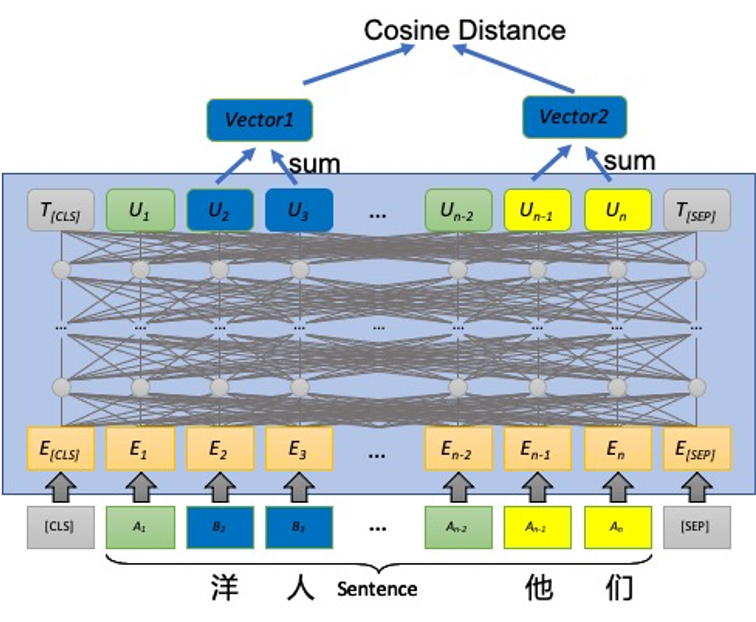

## 训练评测数据
CLUE BENCHMARK:[WSC2020](https://github.com/CLUEbenchmark/CLUEWSC2020)

## 模型结构
 

## finetune 
科大讯飞chinese-roberta-wwm-ext，25batchsize，4个epoch后验证集acc指标84.8%

```txt
epoch	train_loss	train_acc	eval_acc
1	0.6783727633953095	0.61	0.74013
2	0.6274139952659606	0.75	0.77632
3	0.5473524522781372	0.87	0.81908
4	0.4844851231575012	0.92	0.84868
5	0.4599503868818283	0.95	0.82237
6	0.4471856224536896	0.95	0.82566
7	0.4390121865272522	0.96	0.81579
8	0.4361667567491531	0.96	0.80921
9	0.4327015644311905	0.97	0.80921
10	0.43088490545749664	0.97	0.81908
11	0.42737745463848115	0.97	0.81579
12	0.42695351004600524	0.98	0.80592
13	0.4230861431360245	0.98	0.80921
14	0.42373996555805205	0.98	0.79276
15	0.4216070467233658	0.98	0.80263

```